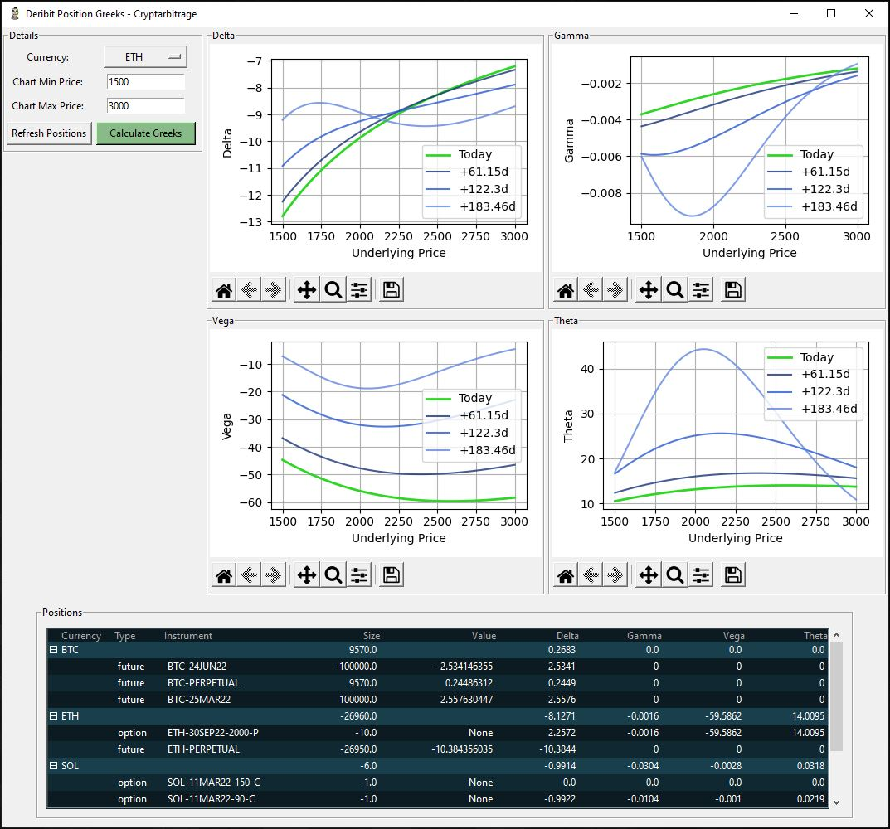

# Deribit Position Greeks
Python code that pulls in your Deribit derivatives positions, then calculates and displays the Greeks of your positions.

Go to https://github.com/cryptarbitrage-code/deribit-position-greeks for the latest code.

Follow me on https://twitter.com/cryptarbitrage for other free resources and content.

Deribit ref-link: https://www.deribit.trade (10% discount on trading fees)

